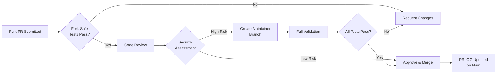

<!--
SPDX-FileCopyrightText: 2025 jerusdp

SPDX-License-Identifier: MIT OR Apache-2.0
-->

# Fork PR Review Process

This document describes how pull requests from forked repositories are securely tested and reviewed in the hcaptcha-rs project.

## Table of Contents

- [For Contributors](#for-contributors)
- [For Reviewers](#for-reviewers)
- [Security Model](#security-model)
- [CircleCI Configuration](#circleci-configuration)
- [FAQ](#faq)

## For Contributors

### How Fork PRs Are Tested

When you submit a pull request from a forked repository, CircleCI automatically runs a **fork-safe validation workflow** that includes:

#### ✅ Automated Tests (Run Immediately)

- **Code formatting**: `cargo fmt --check`
- **Linting**: `cargo clippy --all-targets --all-features`
- **Build verification**: `cargo build` for all workspace packages
- **Unit tests**: `cargo test --all`
- **Test suites**: All feature-specific test suites (default, enterprise, native-only, rustls-only, trace, wasm)
- **Documentation tests**: `cargo test --doc`
- **Dependency audits**: License and security advisory checks

These tests run automatically with **no access to secrets or credentials**, ensuring your PR is tested safely.

#### ⏸️ Restricted Tests (Require Maintainer Approval)

Some tests require access to restricted contexts and will not run on fork PRs:

- **SonarCloud analysis**: Code quality and security scanning (requires SonarCloud context)
- **Code coverage upload**: Coverage reports to Codecov (requires tokens)
- **PRLOG updates**: Changelog updates (requires write access to main branch)

These tests will show as "Unauthorized" in CircleCI. This is **expected behavior** and does not indicate a problem with your PR.

### PRLOG (Changelog) Updates

**Important**: The PRLOG.md changelog is **not** updated in your PR branch. Instead:

1. Your PR goes through review and validation
2. After your PR is merged to main
3. An automated job updates PRLOG.md on the main branch
4. The changelog entry appears in the main branch commit history

This approach:
- ✅ Keeps the process consistent for all contributors
- ✅ Avoids security risks from write operations during PR validation
- ✅ Ensures only merged PRs appear in the changelog

### DCO Sign-Off Requirement

All commits must include a Developer Certificate of Origin (DCO) sign-off:

```bash
git commit -s -m "✨ feat: add new feature"
```

If you forget, you can amend your last commit:

```bash
git commit --amend -s --no-edit
git push --force-with-lease
```

See [CONTRIBUTING.md](../CONTRIBUTING.md) for more details on commit conventions.

### Review Timeline

- **Automated tests**: Complete within 10-15 minutes
- **Maintainer review**: Typically within 2-3 business days
- **Full validation** (if needed): Additional 10-15 minutes after maintainer creates a branch

### What to Expect

1. **PR submitted**: CircleCI fork-safe workflow runs automatically
2. **Tests pass**: Your PR is ready for maintainer review
3. **Tests fail**: Fix issues in your fork and push updates
4. **Maintainer reviews**: Code review focusing on security, quality, and design
5. **Decision**:
   - Simple changes: Merged directly after approval
   - Complex changes: Maintainer may create a branch for full validation
6. **Merged**: PRLOG.md updated automatically on main branch

## For Reviewers

### Review Process Overview



### Step-by-Step Review

#### 1. Verify Automated Checks

Check that the fork-safe CircleCI workflow completed successfully:

- ✅ `toolkit/idiomatic_rust` (fmt, clippy)
- ✅ `toolkit/required_builds` (all packages)
- ✅ `toolkit/common_tests` (all tests)
- ✅ `test-suite` (all variants)
- ✅ `doc_tests`
- ✅ `toolkit/test_wasm`

Note: Jobs requiring contexts (SonarCloud, coverage, PRLOG) will show "Unauthorized" - this is expected.

#### 2. Code Review Checklist

Use the [PR Review Template](.github/PULL_REQUEST_REVIEW_TEMPLATE.md) to guide your review:

**Security**:
- [ ] No hardcoded secrets, API keys, or credentials
- [ ] Input validation appropriate for untrusted data
- [ ] No use of `unsafe` without justification and documentation
- [ ] Error handling doesn't expose sensitive information

**Dependencies**:
- [ ] New dependencies are from trusted sources
- [ ] Licenses are compatible (MIT OR Apache-2.0)
- [ ] No suspicious or unmaintained packages
- [ ] Version constraints are appropriate

**Code Quality**:
- [ ] Follows Rust API Guidelines
- [ ] Code is idiomatic Rust
- [ ] Tests cover new functionality
- [ ] Documentation updated (rustdoc, README, etc.)
- [ ] No clippy warnings introduced

**DCO**:
- [ ] All commits have `Signed-off-by:` line

#### 3. Risk Assessment

Determine the risk level of the change:

| Change Type | Risk Level | Recommended Action |
|-------------|-----------|-------------------|
| Documentation only | **Low** | Merge directly |
| Simple bug fix (< 50 lines) | **Low** | Merge directly |
| Test additions only | **Low** | Merge directly |
| Dependency patch updates | **Low-Medium** | Check advisories, merge directly |
| New feature (< 200 lines) | **Medium** | Create maintainer branch |
| Dependency minor/major updates | **Medium** | Create maintainer branch |
| Large refactoring | **High** | Create maintainer branch |
| Security-sensitive code | **High** | Create maintainer branch + extra review |
| New dependencies | **High** | Create maintainer branch + supply chain review |

#### 4. Decision: Direct Merge or Full Validation

**For Low-Risk Changes** → Merge Directly:
1. Approve the PR
2. Merge to main
3. PRLOG updated automatically by post-merge workflow

**For Medium/High-Risk Changes** → Maintainer Branch:
1. Create a branch in the main repository:
   ```bash
   # Fetch the fork PR
   gh pr checkout <PR_NUMBER>
   
   # Or manually:
   git fetch origin pull/<PR_NUMBER>/head:pr-<PR_NUMBER>
   git checkout pr-<PR_NUMBER>
   
   # Push to a maintainer branch
   git push origin pr-<PR_NUMBER>:maintainer/<branch-name>
   ```

2. CircleCI will run full validation on the maintainer branch (with all contexts):
   - SonarCloud analysis
   - Code coverage with upload
   - Full security scans
   - All tests

3. Review results:
   - If tests pass → Merge the maintainer branch to main
   - If tests fail → Provide feedback to contributor

4. After merge → PRLOG updated automatically

#### 5. Post-Merge Verification

After merging:
1. Verify the post-merge PRLOG update job ran successfully on main
2. Check that PRLOG.md contains the new entry
3. Verify main branch is in good state

### Handling Failed Reviews

If issues are found:
1. Request changes with clear, actionable feedback
2. Explain security concerns if applicable
3. Suggest fixes or improvements
4. Be respectful and constructive

Contributors will fix issues in their fork and push updates, triggering a new CircleCI run.

## Security Model

### CircleCI Fork PR Isolation

CircleCI provides **built-in security isolation** for fork PRs:

#### 🔒 Default Secret Blocking

Fork PR builds **cannot access**:
- Project environment variables
- CircleCI contexts (release, bot-check, pcu-app, SonarCloud)
- SSH keys (deploy keys, user keys)
- AWS credentials
- OIDC tokens

This is enforced by CircleCI's platform and cannot be bypassed by malicious code in the PR.

#### 🔐 Context Restrictions

Sensitive contexts are **restricted to organization members** via GitHub team membership:

- **`release` context**: Contains GITHUB_TOKEN, crates.io tokens (maintainers only)
- **`bot-check` context**: Contains bot credentials (maintainers only)
- **`pcu-app` context**: Contains PCU application credentials (maintainers only)
- **`SonarCloud` context**: Contains SonarCloud tokens (can be accessible or restricted)

Fork PRs attempting to use restricted contexts will fail with "Unauthorized" error and the job will not execute.

### Project Settings

CircleCI project configuration:
- ✅ **"Build forked pull requests"**: Enabled (allows fork PR testing)
- ❌ **"Pass secrets to builds from forked pull requests"**: Disabled (maintains security isolation)

### Reproducible Builds

Fork PRs maintain reproducible build properties:
- `SOURCE_DATE_EPOCH`: Set to last commit timestamp
- `RUSTFLAGS`: Path remapping for deterministic builds
- `CFLAGS`: Path remapping for C dependencies
- Container image: Same pinned image as trusted builds (`jerusdp/ci-rust:1.88-wasi`)

See [REPRODUCIBLE_BUILDS.md](REPRODUCIBLE_BUILDS.md) for details.

### Supply Chain Security

**Container Images**:
- Using pinned container images (`jerusdp/ci-rust@sha256:...`)
- Future: Signature verification with cosign
- Image digests tracked in `ci/container-pins.yaml`

**Dependencies**:
- `Cargo.lock` committed to ensure consistent dependencies
- Dependency auditing with `cargo deny` (advisories, licenses, bans)
- Renovate bot for automated updates with review

**Code Signing**:
- DCO sign-off required for all commits
- Commits must be signed by contributor

## CircleCI Configuration

### Fork-Safe Workflow

The validation workflow runs on all PRs (including forks) with these jobs:

```yaml
validation:
  jobs:
    # Core validation (no contexts required)
    - toolkit/idiomatic_rust
    - toolkit/required_builds
    - toolkit/optional_builds
    - toolkit/common_tests
    - toolkit/test_doc_build
    - doc_tests
    - run_test_program
    - test-suite
    - toolkit/test_wasm
    
    # Requires context (authorized for org members only)
    - toolkit/security (context: SonarCloud)
    - toolkit/code_coverage
    - toolkit/label (context: pcu-app, main branch only)
```

### Post-Merge Workflow

The post-merge workflow runs **only on main branch** after PR merges:

```yaml
post_merge_main:
  jobs:
    - toolkit/update_prlog
      contexts: [release, bot-check, pcu-app]
      filters:
        branches:
          only: main
```

This job:
1. Reads the just-merged PR information
2. Generates PRLOG entry
3. Commits to main branch
4. Pushes update (using SSH key)

### Verifying Configuration

To verify CircleCI is properly configured:

1. **Project Settings** → Advanced:
   - ✅ Build forked pull requests: ON
   - ❌ Pass secrets to builds from forked pull requests: OFF

2. **Organization Settings** → Contexts:
   - `release`: Restricted to `maintainers` team
   - `bot-check`: Restricted to `maintainers` team
   - `pcu-app`: Restricted to `maintainers` team
   - `SonarCloud`: Accessible or restricted based on token permissions

3. **Project Settings** → SSH Keys:
   - Verify deploy key fingerprint matches config: `SHA256:OkxsH8Z6Iim6WDJBaII9eTT9aaO1f3eDc6IpsgYYPVg`

## FAQ

### Why can't fork PRs run SonarCloud analysis?

SonarCloud requires a context with authentication tokens. For security, these contexts are restricted to organization members only. Fork PRs run without contexts to prevent malicious code from accessing secrets.

### Why isn't PRLOG.md updated in my PR?

PRLOG.md is updated **after merge** on the main branch to maintain security and consistency. This ensures:
- No write operations during PR validation (safer for fork PRs)
- Only merged PRs appear in changelog (cleaner history)
- Consistent process for all contributors

### Will my PR be accepted without SonarCloud results?

Yes! The fork-safe tests (fmt, clippy, build, tests) are sufficient for most PRs. Maintainers can create a branch for full validation if needed.

### How do I know if my PR needs full validation?

Low-risk changes (docs, simple fixes, tests) usually don't need full validation. For complex changes, the maintainer will create a branch and run full validation before merging.

### What if I need to test with secrets locally?

You cannot access project secrets. Instead:
- Use environment variables for local testing
- Mock external services in tests
- See test suites for examples of mocking (e.g., `mock-verifier`)

### How can I verify the security of this process?

- CircleCI documentation: https://circleci.com/docs/oss/
- Context restrictions: https://circleci.com/docs/contexts/#restricting-a-context
- Fork PR security: https://circleci.com/docs/oss/#pass-secrets-to-builds-from-forked-pull-requests
- Project SECURITY.md: Security policy and vulnerability reporting

### Who can I contact with questions?

- GitHub Issues: For bugs or feature requests
- GitHub Discussions: For questions or help
- Security issues: See [SECURITY.md](../SECURITY.md) for private reporting

## References

- [CONTRIBUTING.md](../CONTRIBUTING.md): General contribution guidelines
- [SECURITY.md](../SECURITY.md): Security policy and vulnerability reporting
- [GOVERNANCE.md](../GOVERNANCE.md): Project governance and maintainer responsibilities
- [PR_WORKFLOW_DIAGRAMS.md](PR_WORKFLOW_DIAGRAMS.md): Visual workflow diagrams
- [REPRODUCIBLE_BUILDS.md](REPRODUCIBLE_BUILDS.md): Reproducible build documentation
- [CircleCI Fork PR Security](https://circleci.com/docs/oss/)
- [CircleCI Context Restrictions](https://circleci.com/docs/contexts/#restricting-a-context)
