<!--
SPDX-FileCopyrightText: 2025 jerusdp

SPDX-License-Identifier: MIT OR Apache-2.0
-->

# Pull Request Workflow Diagrams

This document visualizes the two different PR workflows: one for forked (untrusted) repositories and one for internal (trusted) PRs.

## Forked PR Workflow (Untrusted Contributors)

```mermaid
flowchart TD
    Start([External Contributor<br/>Creates Fork PR]) --> Trigger[CircleCI Triggered]
    Trigger --> SecCheck{CircleCI Security<br/>Isolation Active}
    
    SecCheck -->|Secrets Blocked| ForkWorkflow[Fork-Safe Workflow Runs]
    
    ForkWorkflow --> ForkJobs[Automated Jobs:<br/>✓ cargo fmt --check<br/>✓ cargo clippy<br/>✓ cargo build<br/>✓ cargo test --all<br/>✓ test-suite variants<br/>✓ doc tests]
    
    ForkJobs --> ContextJobs[Jobs Requiring Contexts:<br/>✗ SonarCloud Unauthorized<br/>✗ Code Coverage Unauthorized<br/>⏸️ PRLOG Update: Post-Merge Only]
    
    ContextJobs --> ForkResult{Fork Tests<br/>Passed?}
    
    ForkResult -->|Failed| FixFork[Contributor Fixes<br/>Issues in Fork]
    FixFork --> Trigger
    
    ForkResult -->|Passed| MaintainerReview[Maintainer Code Review]
    
    MaintainerReview --> SecurityCheck{Security Review<br/>Checklist}
    
    SecurityCheck --> CheckItems[✓ No hardcoded secrets<br/>✓ Input validation OK<br/>✓ No suspicious deps<br/>✓ Tests adequate<br/>✓ DCO sign-off present]
    
    CheckItems --> RiskAssess{Risk Assessment}
    
    RiskAssess -->|Low Risk:<br/>Simple Change| DirectMerge[Merge Directly<br/>to Main]
    
    RiskAssess -->|High Risk:<br/>Complex Change| MaintainerBranch[Maintainer Creates<br/>Branch in Main Repo]
    
    MaintainerBranch --> FullValidation[Full CircleCI Validation]
    
    FullValidation --> FullJobs[All Jobs Run with Contexts:<br/>✓ SonarCloud analysis<br/>✓ Code coverage upload<br/>✓ Security scans<br/>✓ PRLOG update ready]
    
    FullJobs --> FullResult{Full Validation<br/>Passed?}
    
    FullResult -->|Failed| Feedback[Provide Feedback<br/>to Contributor]
    Feedback --> FixFork
    
    FullResult -->|Passed| MergeFull[Merge to Main]
    
    DirectMerge --> PostMerge[Post-Merge Workflow<br/>on Main Branch]
    MergeFull --> PostMerge
    
    PostMerge --> PRLogUpdate[PRLOG.md Updated<br/>Automated Commit]
    PRLogUpdate --> Done([PR Complete])
    
    style Start fill:#e1f5ff
    style SecCheck fill:#fff4e6
    style ForkWorkflow fill:#e8f5e9
    style ContextJobs fill:#ffebee
    style MaintainerReview fill:#f3e5f5
    style RiskAssess fill:#fff9c4
    style DirectMerge fill:#c8e6c9
    style MaintainerBranch fill:#ffe0b2
    style FullValidation fill:#e8f5e9
    style MergeFull fill:#c8e6c9
    style Done fill:#a5d6a7
```

## Internal PR Workflow (Trusted Contributors)

```mermaid
flowchart TD
    Start([Org Member<br/>Creates PR]) --> Trigger[CircleCI Triggered]
    
    Trigger --> AuthCheck{CircleCI<br/>Authentication}
    
    AuthCheck -->|Org Member| FullAccess[Full Context Access<br/>Available]
    
    FullAccess --> ValidationWorkflow[Full Validation Workflow]
    
    ValidationWorkflow --> PreSecJobs[Pre-Security Jobs:<br/>✓ Label management<br/>Context: pcu-app]
    
    PreSecJobs --> CoreJobs[Core Validation Jobs:<br/>✓ cargo fmt<br/>✓ cargo clippy<br/>✓ cargo build all packages<br/>✓ cargo test all packages<br/>✓ test-suite variants<br/>✓ doc tests<br/>✓ wasm tests]
    
    CoreJobs --> SecJobs[Security Jobs:<br/>✓ SonarCloud scan<br/>Context: SonarCloud<br/>✓ cargo audit<br/>✓ Dependency checks]
    
    SecJobs --> CoverageJob[Code Coverage:<br/>✓ Run coverage analysis<br/>✓ Upload to Codecov]
    
    CoverageJob --> AllResult{All Jobs<br/>Passed?}
    
    
    AllResult -->|Failed| FixInternal[Developer Fixes<br/>in PR Branch]
    FixInternal --> Trigger
    
    AllResult -->|Passed| MaintainerReview[Maintainer Review]
    
    MaintainerReview --> ReviewChecks{Review Checks}
    
    ReviewChecks --> CheckList[✓ Code quality<br/>✓ Tests adequate<br/>✓ Docs updated<br/>✓ DCO sign-off<br/>✓ CI green]
    
    CheckList --> Approved{Approved?}
    
    Approved -->|Changes Requested| FixInternal
    
    Approved -->|Approved| Merge[Merge to Main]
    
    Merge --> PostMergeInternal[Post-Merge Workflow<br/>on Main Branch]
    
    PostMergeInternal --> PRLogUpdateInternal[PRLOG.md Updated:<br/>✓ Read merged PR info<br/>✓ Generate changelog entry<br/>✓ Commit to main<br/>Context: release, bot-check, pcu-app<br/>SSH Key: Required]
    
    PRLogUpdateInternal --> Done([PR Complete])
    
    style Start fill:#e3f2fd
    style AuthCheck fill:#fff4e6
    style FullAccess fill:#e8f5e9
    style ValidationWorkflow fill:#e1bee7
    style CoreJobs fill:#b2ebf2
    style SecJobs fill:#ffccbc
    style CoverageJob fill:#c5e1a5
    style PRLogJob fill:#ffe082
    style Merge fill:#c8e6c9
    style Done fill:#a5d6a7
```

## Key Differences

| Aspect | Forked PR (Untrusted) | Internal PR (Trusted) |
|--------|----------------------|---------------------|
| **Secret Access** | ❌ No secrets or contexts | ✅ Full context access |
| **CircleCI Isolation** | ✅ Default secret blocking active | ✅ Authenticated org member |
| **Jobs Run** | Partial: fmt, clippy, build, tests | Full: all validation + security |
| **SonarCloud** | ❌ Unauthorized (context restricted) | ✅ Full scan with upload |
| **PRLOG Update** | ⏸️ Post-merge only (main branch) | ⏸️ Post-merge only (main branch) |
| **Code Coverage** | ❌ Limited/no upload | ✅ Full coverage with upload |
| **Review Process** | Manual security review required | Standard code review |
| **Merge Decision** | Risk-based: direct or via maintainer branch | Direct merge after approval |
| **Full Validation** | Optional via maintainer branch | Automatic on every push |

## Security Controls Summary

### Forked PR Controls
1. **CircleCI Default Isolation**: No secrets passed to fork builds
2. **Context Restrictions**: Sensitive contexts restricted to org members via GitHub teams
3. **Unauthorized Jobs**: Jobs requiring contexts fail gracefully with "Unauthorized"
4. **Manual Review Gate**: Maintainer must review before merge or creating trusted branch
5. **Two-Stage Testing**: Basic tests automatic, full validation optional

### Internal PR Controls
1. **GitHub Team Membership**: Verified org member with context access
2. **Full CI Pipeline**: All security scans and quality checks run automatically
3. **Branch Protection**: Main branch protected, requires PR + reviews
4. **Automated Checks**: PRLOG updates, coverage reports, security scans
5. **DCO Enforcement**: All commits must be signed off

## Decision Matrix for Maintainers

When reviewing a forked PR that passed fork-safe checks:

| Change Type | Risk Level | Recommended Action |
|-------------|-----------|-------------------|
| Documentation only | Low | Merge directly |
| Simple bug fix (< 50 lines) | Low | Merge directly |
| Test additions only | Low | Merge directly |
| Dependency updates (patch) | Low-Medium | Check advisory, merge directly |
| New feature (< 200 lines) | Medium | Create maintainer branch for full validation |
| Dependency updates (minor/major) | Medium | Create maintainer branch for full validation |
| Large refactoring | High | Create maintainer branch for full validation |
| Security-sensitive code | High | Create maintainer branch + extra review |
| New dependencies | High | Create maintainer branch + supply chain review |

## References

- CircleCI Fork PR Security: https://circleci.com/docs/oss/
- CircleCI Context Restrictions: https://circleci.com/docs/contexts/#restricting-a-context
- Project SECURITY.md: Security vulnerability reporting
- Project GOVERNANCE.md: Maintainer responsibilities
